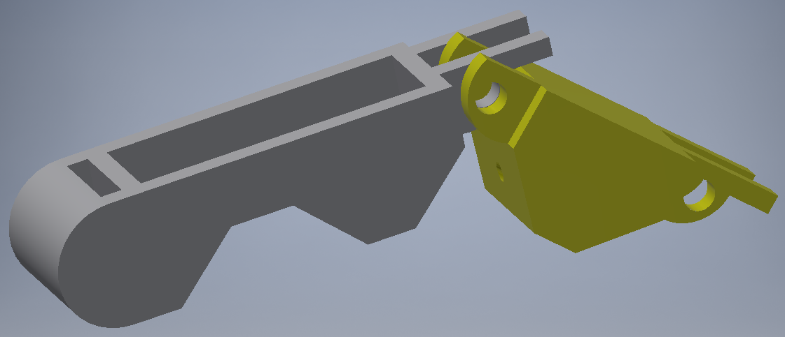

# The Smol Hand 1.0
## Introduction
The Purpose of this project is to create a decently-sized prosthetic arm, fit for a small child to use. Fit with EMG sensors, it allows the user to move the arm by twitching certain muscles.
This documentation goes through the design process, philosophy and schematics of the arm. For a quick look at the arm, check out this [video](https://www.youtube.com/watch?v=ZSc14HTJgZQ), which somewhat highlights the features of the arm (or at least an old version of it).

Before, we go any further, I would like to thank Yotaro Iwai, Williams Kwan and Jen Wen for being great teammates and making this a fun task.

## Disclaimer
This project was a semester-long assessment of the subject MCEN30019 Mechatronics Systems Design at the University of Melbourne. If you are currently enrolled in this subject, I **STRONGLY** advise you to design your own arm, not just because of plagiarism, but it is because it is more enjoyable and more knowledgeable to design one yourself (trust me).

## Let's get started

This project can be split into 3 main parts:
* Mechanical System
* Electrical System
* Software and Sensor

The gist of how the whole system works is that the sensor will read electric pulses from the user, which its readings will be then passed into a microcontroller (in this case it is an Arduino Nano). The microcontroller will then pass signals to the electrical system, which powers the actuator (a servo motor) and hence moves the mechanisms in the hand.

Throughout the project, we had decided to make the arm as simple and small as possible to accompany for our target audience, a 10 year old child in a third world country.
>Any idiot can make something complicated. It takes good design to make something simple.
>
>-Rachel Macfarlane (quoted from somewhere else I think), 2018

## Mechanics
The mechanics behind the hand is rather simple. Each finger has two strings anchored in its top side and bottom side. The top string is connected to the palm, which is fixed. Between the palm and the string is a spring that pulls the finger back into the rest position when the servo is off.  
The bottom string is connected to the servo. When the servo is on, it pulls the finger downwards as the string creates a moment around the joints of the finger, making it curl inwards. There is a spring between the servo and the string to prevent damaging the rigid body of the arm when grabbing large objects.

We have designed these fingers to all be attached to the one same servo. This means that we **cannot** move the fingers individually. The reason we have done this is because we want to make the arm as small and light as possible for the child.

We have also decided not to give it a thumb as it might need it's own actuator, which requires more space and power. We have also found out after a bit of prototyping and experimenting that a thumb would hinder the efficiency of out design.

The parts and assembly of the arm are available in the repository for 3d printing (the .stl files must be scaled by 10x). The parts were designed in a way such that they are easy to assemble and all that is needed are M3 nuts and bolts. The finger parts have an extended end to prevent over-arching when returning to rest position. The top string goes above the bolt to create an upward moment.

>WD40 will always be your bestfriend.
>
>-Ethan Gan, 2018.

## Electrical
The electrical part of the arm consists of 2 switches and 2 power supplies. One of these switch-supply pairs powers the microcontroller, and the other powers the servo motor.  
A standard 9V battery is used to power the microcontroller, while the servo uses two 3.7V Li-ion batteries.

The microcontroller is connected to the EMG sensor and the servo motor. The connections for the circuit is shown below.

The EMG sensor reads the electrical pulses in your muscles. These readings are read by the microcontroller as a voltage depending on how strong of a pulse is given.
The microcontroller then sends a PWM signal to the servo depending on the readings read by the microcontroller.  
Here are the links to the [EMG sensors](https://www.sparkfun.com/products/13723) and [Servo motor](https://www.jaycar.com.au/servo-motor-standard-6-volt-with-metal-gear-11kg/p/YM2765) used (you could use any servo to your liking as long as you adjust the space allowed in the forearm).

A potential improvement for this circuit is to use a voltage regulator, which removes the need on a second power supply and relieving space.

## Software
The software basically makes the arm act as a finite state machine that only has 2 states: open and close. The controller only reacts when the reading is above a certain threshold (an electric pulse/muscle contraction), which then changes the state of the arm.

A possible improvement would be to implement a PID control to move the fingers at a wanted degree change instead of opening and closing entirely, though that would take a lot of time to test and calibrate.

## Assembly
The assembly should take about 2 hours. Each of the finger tips has to be connected to a joint, which is then attached to the palm.

Each finger should be given upper and lower strings (fishing line is what we used). Run the strings through its respective holes through the finger and the joint. Be sure that the upper string is above the bolt when assembling fingers. Once all the fingers have been assembled, run the strings into its respective holes into the palm. The palm is then attached to the forearm, which will house the electrical circuit.

Connect the upper string to a spring each and lock them into the arm. Set up the forearm by placing the electrical components in the spaces shown below. Connect the lower strings and the servo via springs.
Sit the switches and wires through its allocated holes.

Once you have completed the assembly, it should look somewhat like this:

## Usage
Attach ECG electrodes onto the EMG sensor, then attach the electrodes to the back of your forearm (make sure the black electrode is as close to the bone as possible). Turn the switches on, and start moving your ring finger.

Go ahead and start grabbing things. It makes you feel like a sort of machine, doesn't it?

## Lessons Learnt
Throughout the project, we have learnt and understood a few concepts and philosophy behind in engineering design.
* Always think about the user. It gives you a criteria in which you will design your product around
* Complex designs aren't always better. Our design is a fairly simple yet effective one. The ability to hold many things with a tight grip and a 5.9 kg mass test shows this.
* You could achieve things that are unimaginable to people with just a few parts here and there. This project was done under $100 AUD, which is a lot less that what we have initially planned out.

## Epilogue
Anyway, there goes my 1st blog I guess. I have learnt much, from the design of the mechanical parts to the power usage of the components to how we can put everything together.

To those who are doing engineering, I wish you luck in designing and performing your projects. To those who are just starting, start thinking creatively. See improvements in everything and ask yourself: "how can I improve this?".
>Normal people... believe that if it ain't broke, don't fix it. Engineers believe that if it ain't broke, it doesn't have enough features yet.
>
>-Scott Adams

I would like to thank you for reading this. I hope you found it interesting. And to my friends and family, here's one last wacky quote.
>I hate you Alana!
>
>-John Kounetas
